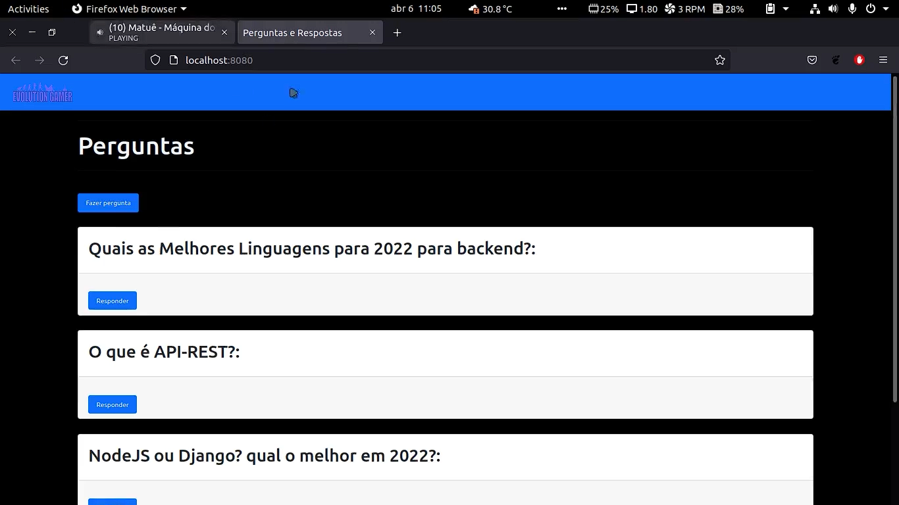
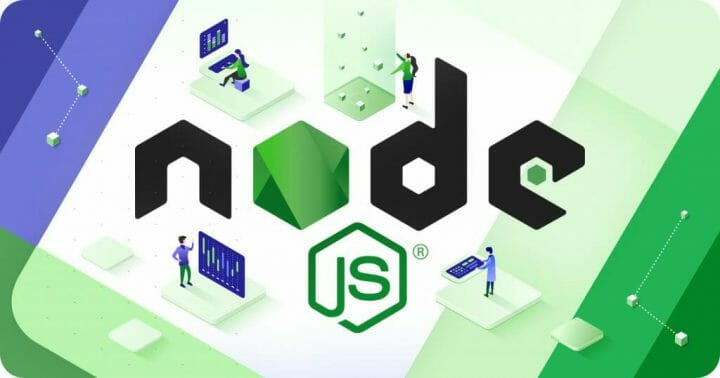
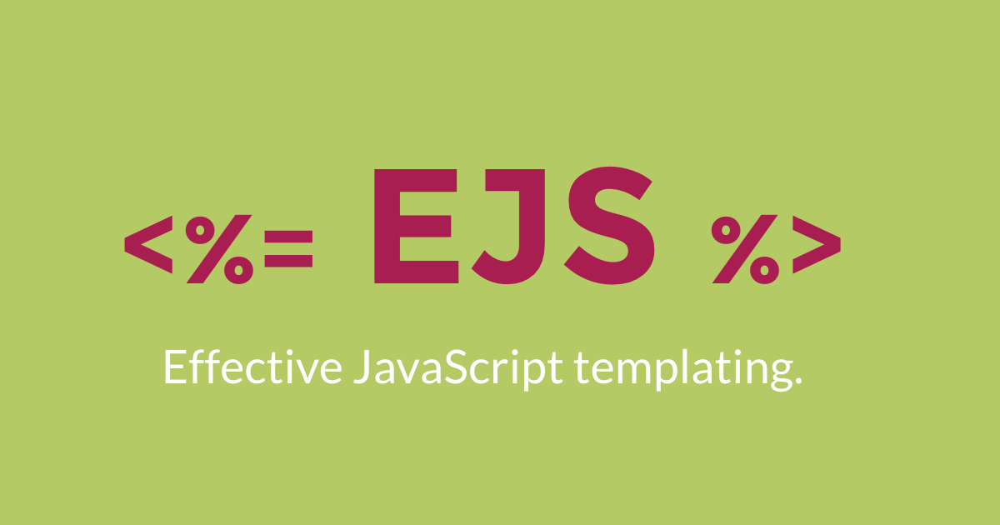
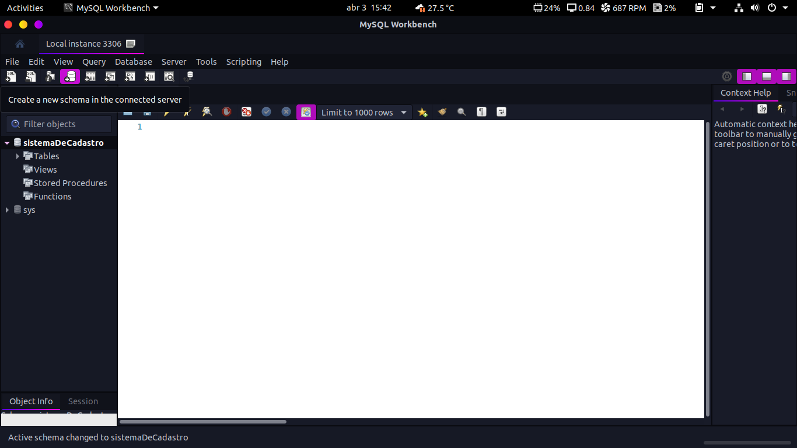
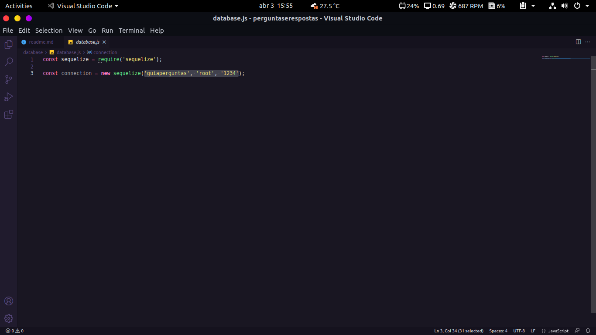
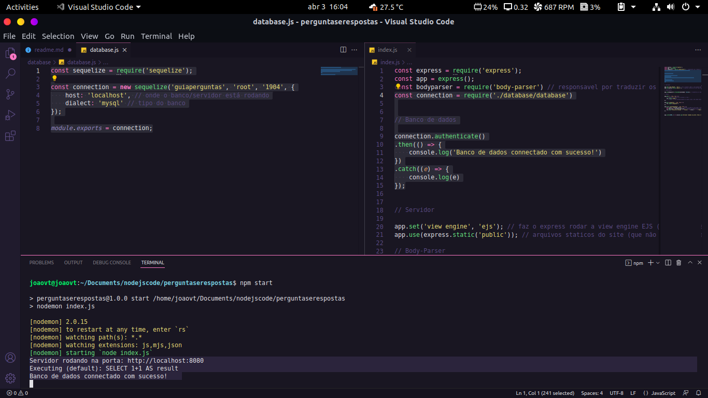
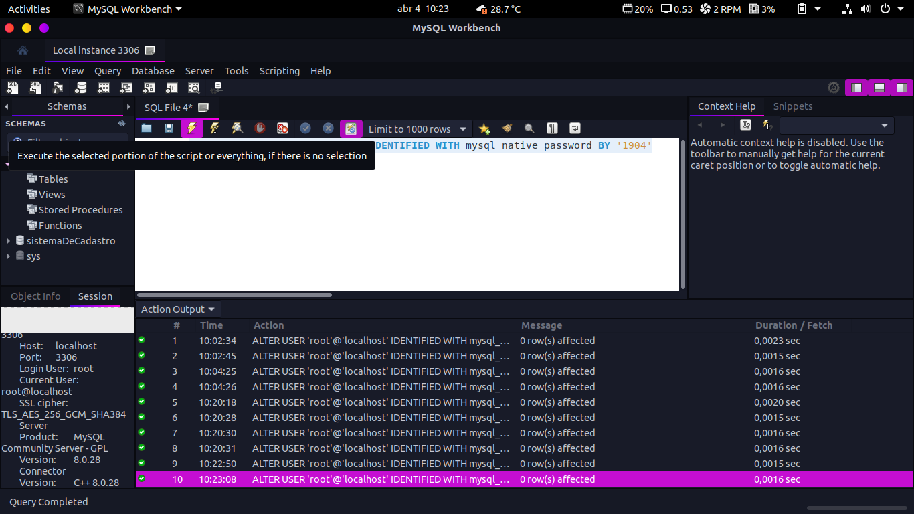

# Site de perguntas e respostas

 
    
- esse site foi feito usando NodeJS + EJS + Express + Mysql.
- O site consiste é parecido com muitos que vemos por ai, onde você pode fazer uma pergunta anônima e alguèm responder anônimamente também.
- O site eu fiz sem exigir nenhum login, o que geralmente não ocorre em um site de perguntas em respostas. por tanto caso pretenda fazer alguma melhoria, fica a dica.

## Iniciar o Projeto

 

- O projeto conta com algumas bibliotecas / frameworks. portanto o nosso package.json tem todas as dependências necessarias para que o projeto funcione.
    - então precisamos rodar o seguinte comando: * npm install *. 
    - após ter rodado este comando ele irá instalar todas as dependências de nosso package.json, instalando junto o express, ejs e nodemon por exemplo.

## O que é o EJS?
   
   
 
   
  - Bom, eu resolvi explicar o motivo do uso do EJS ao Invés do HTML.
  - Então, é isso mesmo que você pensou, esse EJS citado na inicialização do projeto é um HTML, porém com a extensão diferente (ejs).
  - o motivo do uso ejs é que a engine dele é carregado pelo NodeJS/Express.
  - "O EJS é uma engine de visualização, com ele conseguimos de uma maneira fácil e simples transportar dados do back-end para o front-end, basicamente conseguimos utilizar códigos em javascript no html de nossas páginas."
  - Você pode saber mais sobre ele acessando o site: https://ejs.co/

# Banco de dados MySQL

 

- O banco de dados que usei foi o MySQL, portanto é importante que você tenha ele instalado em sua maquina.
 - No youtube existem diversos tutitoriais ensinando a se instalar um Banco de dados MySQL seja em sistema operacional Linux ou Windows.
 - Para não te deixar na mão, recomendarei dois videos para instalar o seu Banco de dados:
      - Windows: <a href="https://www.youtube.com/watch?v=fmerTu7dWk8&t=327s&ab_channel=B%C3%B3sonTreinamentos">Link</a>
      - Linux: <a href="https://www.youtube.com/watch?v=CBK7c1xp-zI&list=LL&index=11&ab_channel=B%C3%B3sonTreinamentos">Link</a>
 
- Instalado o MySQL seguimos com algumas configurações no banco de dados.

## Sequelize com MySQL

 - Para usar o MySQL junto com nossa aplicação iremos ultilizar o sequelize, uma das melhores bibliotecas para se trabalhar / manipular o seu banco de dados SQL. 
 - vale ressaltar que o * sequelize * não funciona somento com banco de dados MySQL e sim com outros banco de dados SQL, como por exemplo o PostgreSQL e MariaDB.
   * o sequilize faz todo o processo de conexão e manipulação do banco de dados através do NODE sem a necessidade de precisar trabalhar com código SQL. ou seja, ao invés de você usar código SQL para criar, deletar etc... o usuário. você ira fazer isso com código JS.
 -  para instalar o sequelize iremos rodar o seguinte comando: 
   * npm install --save sequelize
    * Obsv: Você não precisa rodar os comando acima devido a já terem sido instaladas ao você iniciar o projeto, pois faz parte das dependências.

## Configurando o Banco MySQL  
  - Para configurar o Banco MySQL com o sequelize iremos abrir o nosso MySQL-Workbench e criar um novo schema. 
   
  
  - coloque o nome do banco de dados de: * guiaperguntas * e em seguida vá clicando em apply conforme for pedindo.
  - após ter definido o nome do banco de dados, na pásta database/database.js nós definimos para o sequilize a origem dele passando o seu nome, usuario e senha. 
   
  - após ter feito essa configuração, eu exportei o banco e puxei o mesmo na nossa aba principal que roda o servidor "index.js" e rodei dando um npm start.
   
  
 ## Erro com MySQL
 
  - em caso de erro de autenticação com o MySQL, Abra seu MySQL WorkBench, clique em "CREATE A NEW SQL TAB FOR EXECUTING QUERIES" caso esteja em inglês, ou, "CRIAR UMA NOVA ABA SQL PARA EXECUTAR CONSULTAS" se estiver em portugês. agora rode o seguinte comando: * ALTER USER 'root'@'localhost' IDENTIFIED WITH mysql_native_password BY 'suasenhaatual' * e clique no raiozinho para executar. 
   
  - rode o comando: * npm start * para verificar se está tudo correto.
## Rodar o projeto.

  - para rodar o projeto, iremos rodar o seguinte comando: * npm start
  - e acessar no seu navegador o endereço: 
    * http://localhost:8080

## Site Funcionando
    
- clique no gif para ver o vídeo do site:    

